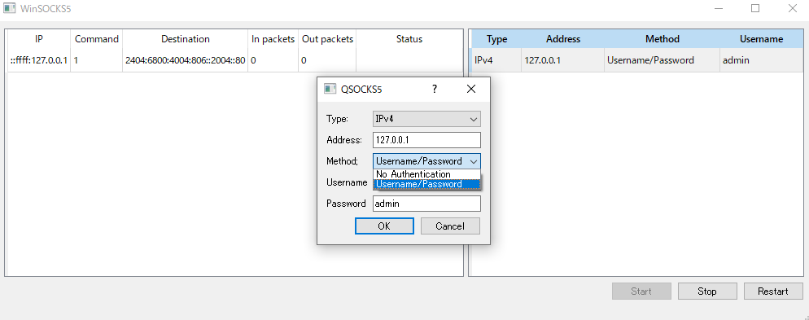

# QSOCKS5
socks5 server by qt



## Requirements
Qt 5.15 以上

## Build macOS
```
cmake -S . -B build -DCMAKE_PREFIX_PATH=/usr/local/Cellar/qt@5/5.15.2_1
cmake --build build
```

## Windows
```
cmake -S . -B build\Win32 -DCMAKE_PREFIX_PATH=C:\Qt\5.15.2\msvc2019 -A Win32
cmake --build build\Win32 --config Release
cmake --install build\Win32 --prefix "install\Win32" --strip
C:\Qt\5.15.2\msvc2019\bin\windeployqt --release --compiler-runtime install\Win32\bin\QSOCKS5.exe

cmake -S . -B build\x64 -DCMAKE_PREFIX_PATH=C:\Qt\5.15.2\msvc2019_64 -A x64
cmake --build build\x64 --config Release
cmake --install build\x64 --prefix "install\x64" --strip
C:\Qt\5.15.2\msvc2019_64\bin\windeployqt --release --compiler-runtime install\x64\bin\QSOCKS5.exe
```